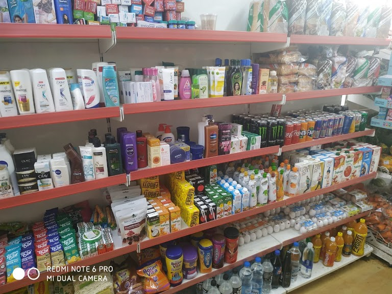
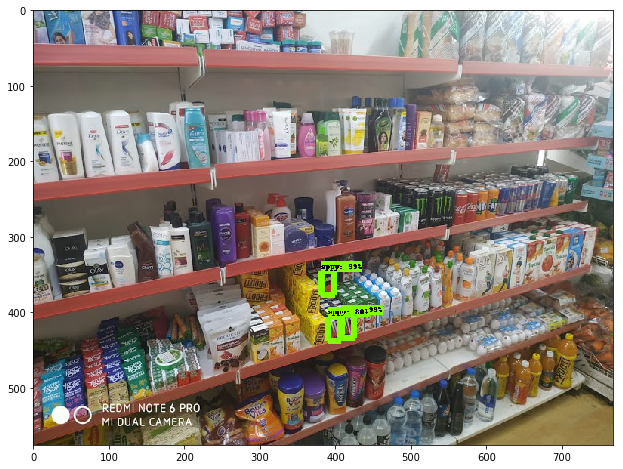

# Identify-a-product-in-store
Here I have trained Mobilenet V2 neural network model with many images of Appy fizz and these are the results.  
Note- 
1.Please follow the provided "fizz.ipynb" to train the neural network 
2.I have used Google Colab for training purpose so it would be better if you use it. 
3.If you want the inference graph, then it is in models folder  
Original image 
 
Detected Image 
 
If you want to find more information about the testing please open this google drive link - 
https://drive.google.com/drive/folders/1AO6WJk-DV1lPAsFtDJ8r3JFIbzY809D0  
