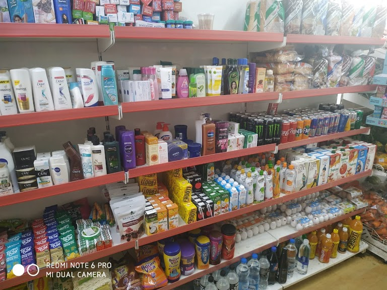
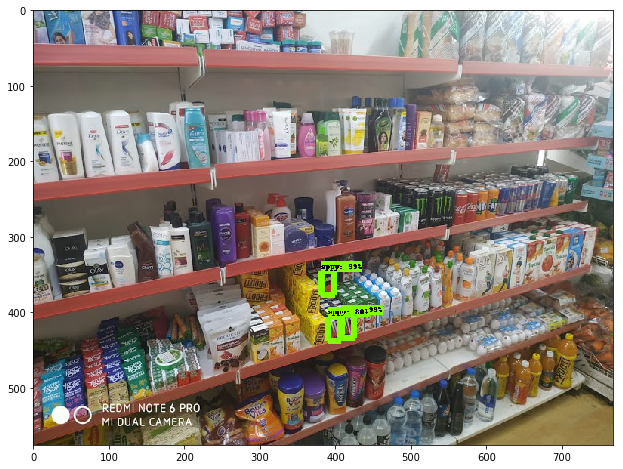

# Identify-a-product-in-store
Here I have trained Mobilenet V2 neural network model with many images of Appy fizz and these are the results.  
Note-
Please follow the provided "fizz.ipynb" to train the neural network 
I have used Google Colab for training purpose so it would be better if you use it. 
If you want the inference graph, then it is in models folder 
Original image

Detected Image

